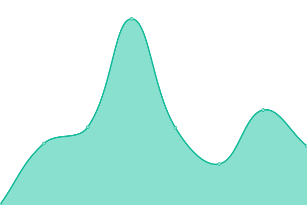

# [📈 Live Status](https://ReArmedHalo.github.io/holonet-status): <!--live status--> **🟥 Complete outage**

This repository contains the open-source uptime monitor and status page for [Dustin Schreiber](https://www.dustinschreiber.com), powered by [Upptime](https://github.com/upptime/upptime).

With [Upptime](https://upptime.js.org), you can get your own unlimited and free uptime monitor and status page, powered entirely by a GitHub repository. We use [Issues](https://github.com/ReArmedHalo/holonet-status/issues) as incident reports, [Actions](https://github.com/ReArmedHalo/holonet-status/actions) as uptime monitors, and [Pages](https://ReArmedHalo.github.io/holonet-status) for the status page.

<!--start: status pages-->
<!-- This summary is generated by Upptime (https://github.com/upptime/upptime) -->
<!-- Do not edit this manually, your changes will be overwritten -->
<!-- prettier-ignore -->
| URL | Status | History | Response Time | Uptime |
| --- | ------ | ------- | ------------- | ------ |
|  [Dashboard](https://holonet.us) | 🟥 Down | [dashboard.yml](https://github.com/ReArmedHalo/holonet-status/commits/HEAD/history/dashboard.yml) | 

 692ms
     
 | 

<a href="https://ReArmedHalo.github.io/holonet-status/history/dashboard">99.98%</a>
    

|  Plex | 🟥 Down | [plex.yml](https://github.com/ReArmedHalo/holonet-status/commits/HEAD/history/plex.yml) | 

 315ms
     
 | 

<a href="https://ReArmedHalo.github.io/holonet-status/history/plex">99.98%</a>
    

|  [Overseerr](https://overseerr.holonet.us) | 🟥 Down | [overseerr.yml](https://github.com/ReArmedHalo/holonet-status/commits/HEAD/history/overseerr.yml) | 

 804ms
     
 | 

<a href="https://ReArmedHalo.github.io/holonet-status/history/overseerr">99.99%</a>
    

|  BitWarden | 🟥 Down | [bit-warden.yml](https://github.com/ReArmedHalo/holonet-status/commits/HEAD/history/bit-warden.yml) | 

 399ms
     
 | 

<a href="https://ReArmedHalo.github.io/holonet-status/history/bit-warden">99.99%</a>
    

|  [UniFi Controller](https://unifi.holonet.us) | 🟥 Down | [uni-fi-controller.yml](https://github.com/ReArmedHalo/holonet-status/commits/HEAD/history/uni-fi-controller.yml) | 

 653ms
     
 | 

<a href="https://ReArmedHalo.github.io/holonet-status/history/uni-fi-controller">96.70%</a>
    

<!--end: status pages-->

[**Visit our status website →**](https://ReArmedHalo.github.io/holonet-status)

## 📄 License

- Powered by: [Upptime](https://github.com/upptime/upptime)
- Code: [MIT](./LICENSE) © [Dustin Schreiber](https://www.dustinschreiber.com)
- Data in the `./history` directory: [Open Database License](https://opendatacommons.org/licenses/odbl/1-0/)
